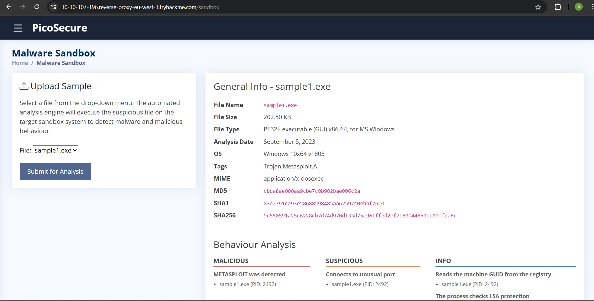
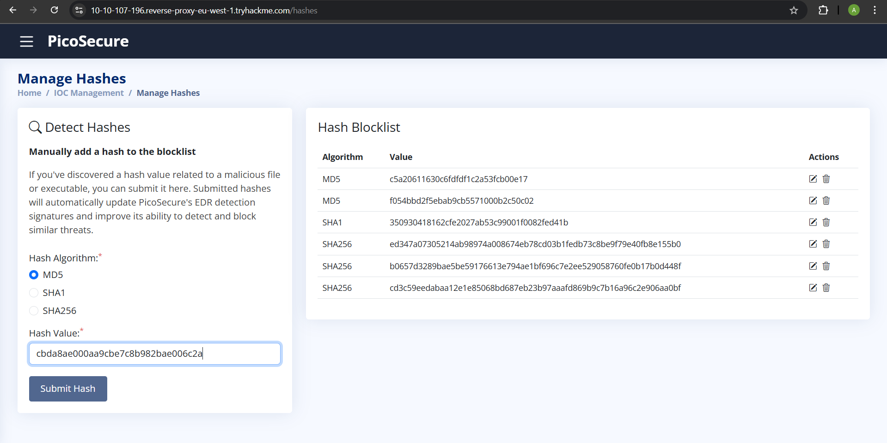
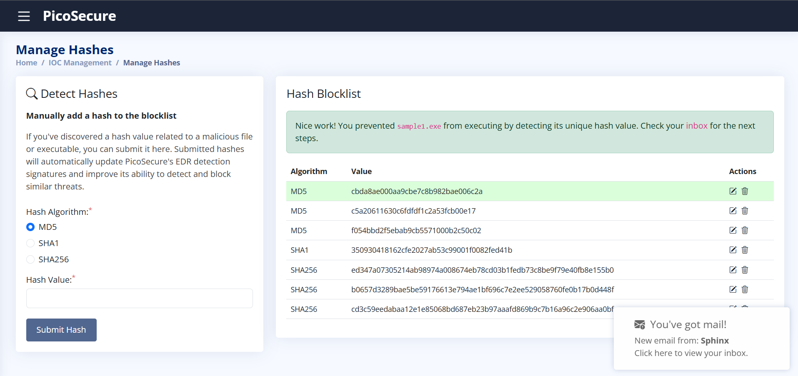
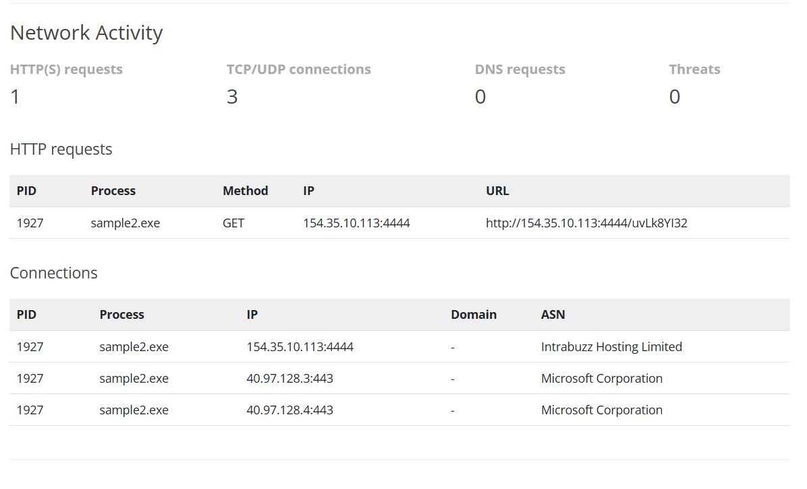
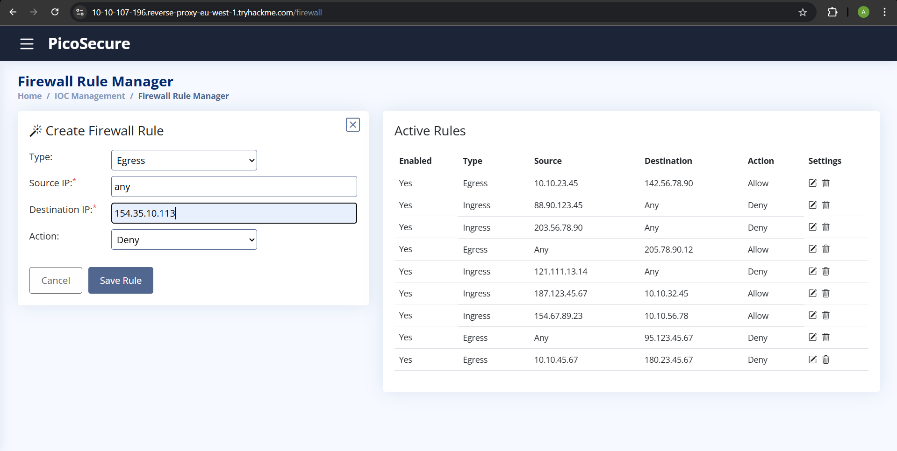
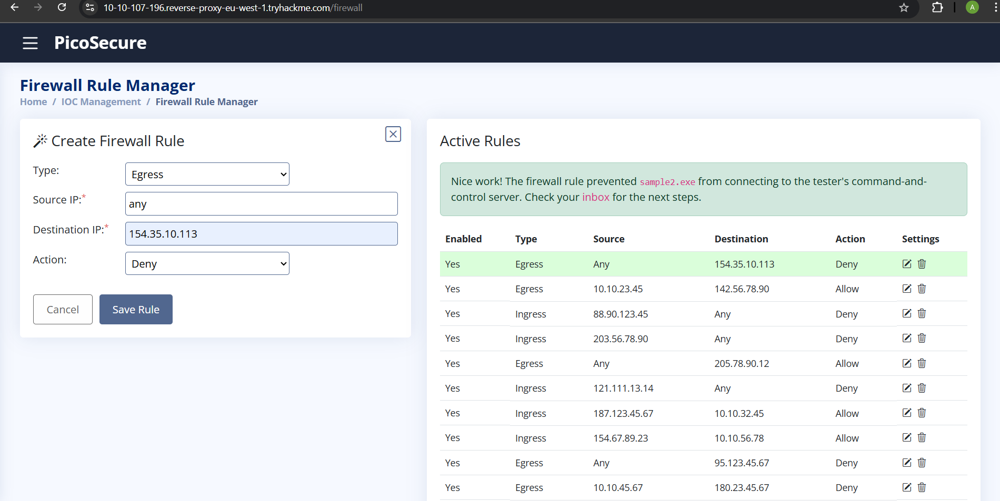
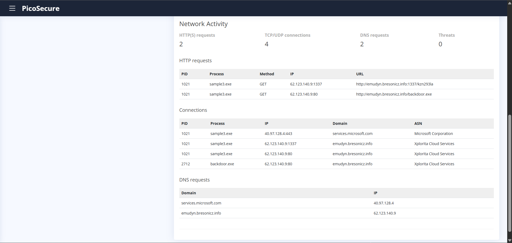
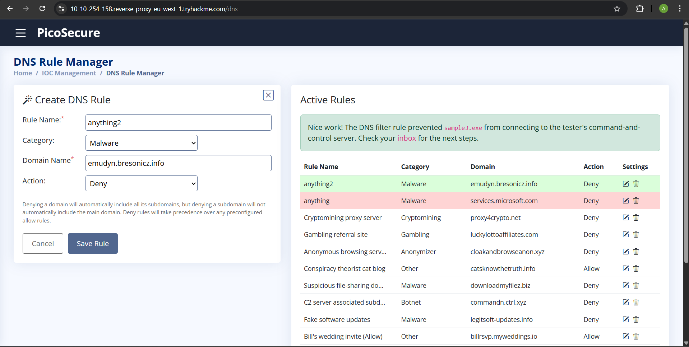
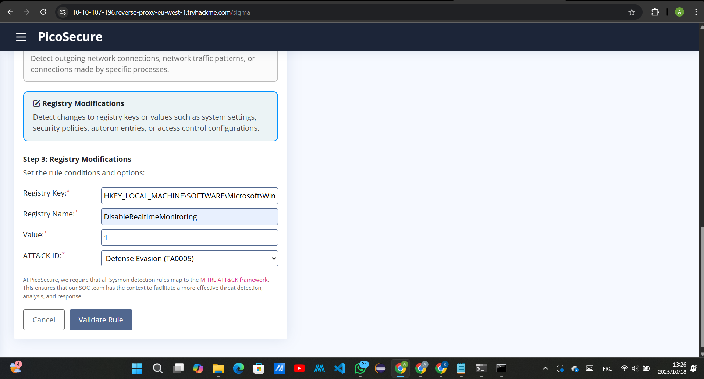
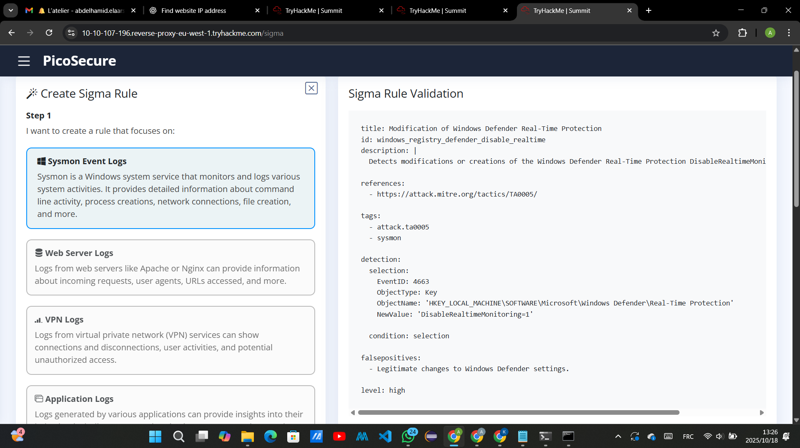

# TryHackMe Room: Summit Report

Hello everyone, in this report I will explain how I solved a **THM room: Summit**  
(*Can you chase a simulated adversary up the Pyramid of Pain until they finally back down?*)  
while trying some of the skills on my own computer using the terminal emulator.  

Anyway, let's start and everything will be clear :).

---

## Example 1

After analyzing the example, this is what it gave us:  


For this example, I chose to work with **hash-based detection**, so I copied the hash value of the malicious file (MD5 function) and pasted it into the hash block list to automatically detect and block similar threats.  



---

## Example 2

After analyzing the example, this is what it gave us:  


As we see, the malicious file is trying to connect to a malicious URL — probably a server to say *I’m alive*, so we need to break the connection. Let's use the **Firewall Manager**.  


- We will specify the traffic way: **egress** (traffic leaving the network)  
- The **source IP**: any (any IP used and any port to request the server)  
- The **destination IP**: `154.35.10.113` (that’s the destination IP we found in the analysis)  
- **Action**: deny  

And let's click **Save Rule**.  


After this, I decided to do a real test of adding a firewall rule on my PC. Let's try it together:  
First, let's choose a target website — I decided to test on **LinkedIn**.  
So, let's open **Run > Command Prompt** as administrator and start.

```cmd
(c) Microsoft Corporation. All rights reserved.

C:\Windows\System32> REM let's find LinkedIn's IP

C:\Windows\System32>ping linkedin.com

Pinging linkedin.com [150.171.22.12] with 32 bytes of data:
Reply from 150.171.22.12: bytes=32 time=180ms TTL=111
Reply from 150.171.22.12: bytes=32 time=92ms TTL=111
Reply from 150.171.22.12: bytes=32 time=182ms TTL=111
Reply from 150.171.22.12: bytes=32 time=59ms TTL=111

Ping statistics for 150.171.22.12:
    Packets: Sent = 4, Received = 4, Lost = 0 (0% loss),
Approximate round trip times in milliseconds:
    Minimum = 59ms, Maximum = 182ms, Average = 128ms

C:\Windows\System32>REM now after we have it let's create the rule

C:\Windows\System32>netsh ?
...
C:\Windows\System32>netsh advfirewall ?
...
C:\Windows\System32>REM now after we discovered the command can be used let's do it

C:\Windows\System32>netsh advfirewall firewall add rule name="test of blocking LinkedIn for my GitHub repo :-) " dir=out action=block remoteip=150.171.22.12
Ok.

C:\Windows\System32>REM let's test it

C:\Windows\System32>ping linkedin.com

Pinging linkedin.com [150.171.22.12] with 32 bytes of data:
General failure.
General failure.
General failure.
General failure.

Ping statistics for 150.171.22.12:
    Packets: Sent = 4, Received = 0, Lost = 4 (100% loss),

C:\Windows\System32>REM as we can see it totally worked

C:\Windows\System32>REM now let's try to reopen it because obviously I need LinkedIn to find an internship :).

C:\Windows\System32>netsh advfirewall firewall delete rule name="test of blocking LinkedIn for my GitHub repo :-) "

Deleted 5 rule(s).
Ok.

C:\Windows\System32>REM let's see if it's working again.

C:\Windows\System32>ping linkedin.com

Pinging linkedin.com [150.171.22.12] with 32 bytes of data:
Reply from 150.171.22.12: bytes=32 time=152ms TTL=111
Reply from 150.171.22.12: bytes=32 time=84ms TTL=111
Reply from 150.171.22.12: bytes=32 time=127ms TTL=111
Reply from 150.171.22.12: bytes=32 time=82ms TTL=111

Ping statistics for 150.171.22.12:
    Packets: Sent = 4, Received = 4, Lost = 0 (0% loss),
Approximate round trip times in milliseconds:
    Minimum = 82ms, Maximum = 152ms, Average = 111ms

C:\Windows\System32>REM yes, it is working properly so mission succeeded!
```

---

## Example 3

After analyzing the example, this is what it gave us:  


As we can see in the analysis, the malicious file tried to connect to two DNSs.  
We will block the malicious one, which appears to be the tester's command and control server.  


Let's use the **DNS Rule Manager**:

- **Rule Name:** anything2 (let's give our rule a name)  
- **Category:** Malware  
- **Domain name:** `emudyn.bresonicz.info` (the domain we want to block)  
- **Action:** deny  

Again, let's try it on our machine:  

Regarding the Pyramid of Pain, changing the IP address is much easier than the DNS address because it will cost the attacker more time and money.  
So first, let's create a domain name to test our little code on.  

I went to **DuckDNS** and created a domain named `mythmlabtest.duckdns.org`.  
Now let's open our CMD and start.

```cmd
C:\Windows\System32>ping mythmlabtest.duckdns.org

Pinging mythmlabtest.duckdns.org [8.8.8.8] with 32 bytes of data:
Reply from 8.8.8.8: bytes=32 time=67ms TTL=116
Reply from 8.8.8.8: bytes=32 time=304ms TTL=116
Reply from 8.8.8.8: bytes=32 time=255ms TTL=116
Reply from 8.8.8.8: bytes=32 time=68ms TTL=116

Ping statistics for 8.8.8.8:
    Packets: Sent = 4, Received = 4, Lost = 0 (0% loss),
Approximate round trip times in milliseconds:
    Minimum = 67ms, Maximum = 304ms, Average = 173ms

C:\Windows\System32>netsh advfirewall firewall add rule name="(prove DNS blocking is more solid than IP blocking :-) " dir=out action=block remoteip=8.8.8.8
Ok.

C:\Windows\System32>ping mythmlabtest.duckdns.org

Pinging mythmlabtest.duckdns.org [8.8.8.8] with 32 bytes of data:
General failure.
General failure.
General failure.
General failure.

Ping statistics for 8.8.8.8:
    Packets: Sent = 4, Received = 0, Lost = 4 (100% loss),

C:\Windows\System32>REM let's change our website's IP and try to connect again

C:\Windows\System32>curl "https://www.duckdns.org/update?domains=mythmlabtest&token=5ae98476-147d-4e89-9f40-fdf054ce76ef&ip=1.1.1.1"
OK
C:\Windows\System32>REM now let's try to connect to the website again

C:\Windows\System32>ping mythmlabtest.duckdns.org

Pinging mythmlabtest.duckdns.org [1.1.1.1] with 32 bytes of data:
Reply from 1.1.1.1: bytes=32 time=67ms TTL=54
Reply from 1.1.1.1: bytes=32 time=120ms TTL=54
Reply from 1.1.1.1: bytes=32 time=118ms TTL=54
Reply from 1.1.1.1: bytes=32 time=99ms TTL=54

Ping statistics for 1.1.1.1:
    Packets: Sent = 4, Received = 4, Lost = 0 (0% loss),
Approximate round trip times in milliseconds:
    Minimum = 67ms, Maximum = 120ms, Average = 101ms

C:\Windows\System32>REM we got a reply, so blocking the IP is not enough. We should take another step in the Pyramid of Pain and block the DNS.
```

Now let's open PowerShell.

```powershell
PS C:\Windows\system32> $domain = "mythmlabtest.duckdns.org"
>> $ips = (Resolve-DnsName $domain).IPAddress
>> foreach ($ip in $ips) {
>>     New-NetFirewallRule -DisplayName "Block $domain ($ip)" -Direction Outbound -Action Block -RemoteAddress $ip
>> }
>>


Name                          : {de6871b8-4133-439e-a801-482e0914760a}
DisplayName                   : Block mythmlabtest.duckdns.org (1.1.1.1)
Description                   :
DisplayGroup                  :
Group                         :
Enabled                       : True
Profile                       : Any
Direction                     : Outbound
Action                        : Block
Status                        : The rule was parsed successfully from the store.
```

Now, no matter what IP the domain name has, it won’t connect.

---

## Example 4

After analyzing the example, this is what it gave us:  


Let's create a **Sigma rule** that detects changes to registry keys or values such as system settings, security policies, autorun entries, or access control configurations.  
  


Now we successfully created it.
