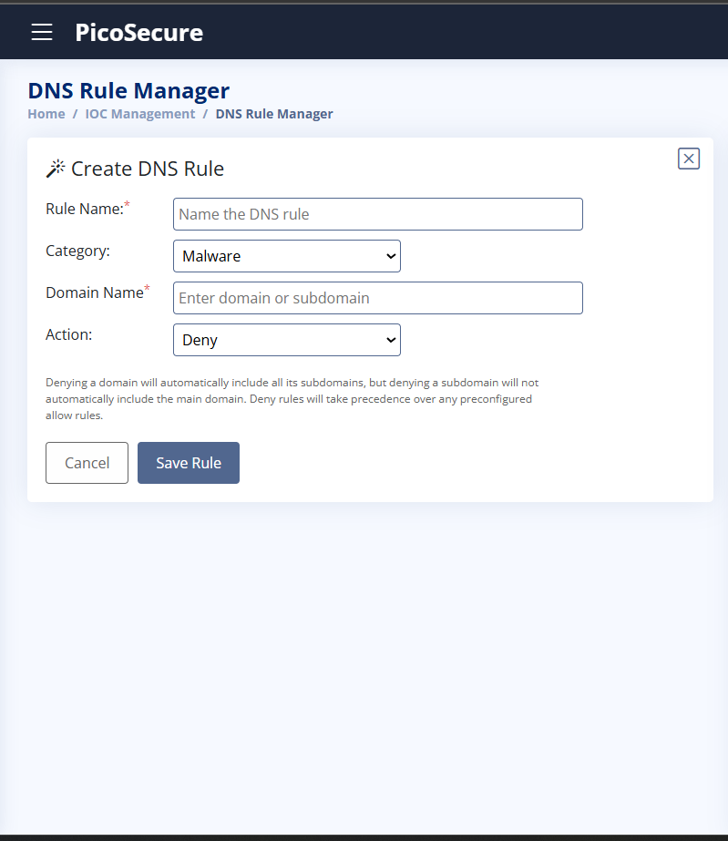

# TryHackMe: Summit — Pyramid of Pain Walkthrough

Hello everyone! 👋  

In this report, I’ll explain how I solved the **TryHackMe room: Summit**  
> *Can you chase a simulated adversary up the Pyramid of Pain until they finally back down?*

I also tried some of the techniques on my own computer using the terminal emulator.  
Let’s get started! 🚀  

---

## 🧩 Example 1 — Hash-Based Detection

After analyzing the example, this is what we got:


For this example, I chose to work with **hash-based detection**.  
I copied the hash value of the malicious file (using the **MD5 function**) and pasted it into the hash block list to automatically detect and block similar threats.


---

## 🌐 Example 2 — Blocking Malicious Traffic via Firewall

After analyzing the example, this is what we got:


As we can see, the malicious file is trying to connect to a malicious URL — probably a command server to signal that it’s alive.  
We need to break the connection using the **Firewall Manager**.


### Firewall Rule Setup

- **Traffic Direction:** Egress (traffic leaving the network)  
- **Source IP:** Any (any IP or port requesting the server)  
- **Destination IP:** `154.35.10.113` (from the analysis)  
- **Action:** Deny  

Then click **Save Rule**.


---

### 💻 Real Test: Adding a Firewall Rule on Windows

Now, let’s do a real test on my PC.  
I decided to block **LinkedIn** for demonstration.

Run **Command Prompt as Administrator** and follow along:

```cmd
REM Find LinkedIn’s IP
ping linkedin.com
```

Output example:
```
Pinging linkedin.com [150.171.22.12] with 32 bytes of data:
Reply from 150.171.22.12: bytes=32 time=180ms TTL=111
...
```

Now create the blocking rule:

```cmd
netsh advfirewall firewall add rule name="Test blocking LinkedIn for my GitHub repo :-)" dir=out action=block remoteip=150.171.22.12
```

Test it again:

```cmd
ping linkedin.com
```

Result:
```
General failure.
General failure.
General failure.
General failure.
```

✅ **Blocked successfully!**

To remove the rule and restore access:

```cmd
netsh advfirewall firewall delete rule name="Test blocking LinkedIn for my GitHub repo :-)"
```

Then test again — LinkedIn should respond normally.  
**Mission succeeded!** 🎯

---

## 🧱 Example 3 — DNS Blocking

After analyzing the example, this is what we got:


The malicious file tried to connect to two DNS addresses.  
We’ll block the malicious one, which seems to be the tester’s command-and-control (C2) server.



### DNS Rule Setup

- **Rule Name:** anything2  
- **Category:** Malware  
- **Domain Name:** `emudyn.bresonicz.info`  
- **Action:** Deny  

---

### 🧠 Why DNS Blocking?

According to the **Pyramid of Pain**, changing an IP address is easier for the attacker than changing a DNS address — it costs more time and effort.  

Let’s test this idea.

I created a test domain on **DuckDNS**:  
`mythmlabtest.duckdns.org`

Now open CMD and try:

```cmd
ping mythmlabtest.duckdns.org
```

Then block its IP:

```cmd
netsh advfirewall firewall add rule name="Prove DNS blocking is more solid than IP blocking :-)" dir=out action=block remoteip=8.8.8.8
```

Result:
```
General failure.
General failure.
...
```

Now change the website’s IP:

```cmd
curl "https://www.duckdns.org/update?domains=mythmlabtest&token=YOUR_TOKEN&ip=1.1.1.1"
```

Ping again — it works!  
So, blocking only by IP isn’t enough.

---

### ⚙️ PowerShell: DNS Blocking Automation

Let’s block the **domain** instead of the IP:

```powershell
$domain = "mythmlabtest.duckdns.org"
$ips = (Resolve-DnsName $domain).IPAddress
foreach ($ip in $ips) {
    New-NetFirewallRule -DisplayName "Block $domain ($ip)" -Direction Outbound -Action Block -RemoteAddress $ip
}
```

Now, no matter what IP the domain resolves to — **it’s blocked**. 🔒

---

## 🧰 Example 4 — Sigma Rule for Registry Monitoring

After analyzing the example, this is what we got:


We’ll create a **Sigma rule** that detects changes to registry keys or values related to:
- System settings  
- Security policies  
- Autorun entries  
- Access control configurations  

  


✅ Successfully created the Sigma rule!
